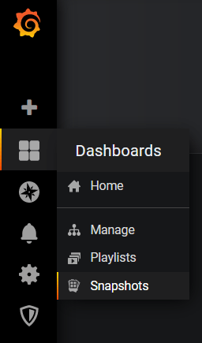

# `grafsnap`: Grafana Snapshot Creation and Restoration

`grafsnap` is a command line tool to dump Grafana dashboards as snapshots into local JSON files, and
upload these JSON files back into Grafana as Snapshots. This allows users to exchange metrics data
without relying on the `snapshot.raintank.io` service.

## Global flags

### `-b`, `--base` *URL*

The base URL of the Grafana instance. Defaults to `http://localhost:3000/`.

### `-k`, `--api-key` *Key*

The API key or username:password.

If not supplied, `grafsnap` will try to fetch the information from the `$GRAFANA_API_KEY`
environment variable. If even this environment variable is empty, it will use `admin:admin` as the
login credentials.

If [basic authentication](https://grafana.com/docs/grafana/latest/auth/overview/#basic-authentication)
is enabled on Grafana (true by default), you can use `username:password` as the "API key".

A true API key can be generated in the Organization Configuration. See
[Grafana's documentation](https://grafana.com/docs/grafana/latest/http_api/auth/#create-api-token)
for details.

### `-j`, `--concurrency` *Number*

`grafsnap` will execute multiple HTTP requests in parallel if possible. This specifies the maximum
number of requests can be run in parallel. Defaults to 4.

## Usage: Import Snapshot JSON files into Grafana

Given some [existing snapshot JSON files](../../README.md#export-dashboards-as-snapshot-json-files)
(or a zip archive of such JSON files), you could import them into other Grafana instances to
visualize the snapshot.

```sh
./grafsnap import snap-1.json snap-2.json snapshots.zip
```

On success, it will reply with a JSON listing URLs to each snapshot.

```json
[
  {
    "file": "snap-1.json",
    "url": "http://localhost:3000/dashboard/snapshot/iuh7FMwCOUvyt3rGZpjXecq05LlJfQ9k"
  },
  {
    "file": "snap-2.json",
    "url": "http://localhost:3000/dashboard/snapshot/VdkaIU5AlrePfT6hX2Jv0qBNgjG7pizL"
  },
  {
    "file": "snapshots.zip",
    "content": [
      {
        "file": "snap-3.json",
        "url": "http://localhost:3000/dashboard/snapshot/eMvpgqtd9LNxcFiUrsR6G5SujBJo3n14"
      },
      {
        "file": "snap-4.json",
        "url": "http://localhost:3000/dashboard/snapshot/1GkecznHMuDxwo0vityPrVIKmgA5LJ38"
      }
    ]
  }
]
```

The snapshots can also be found inside Grafana in Dashboards → Snapshots from the sidebar.


