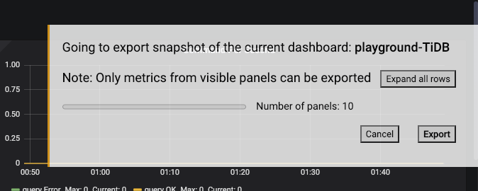

# User script for exporting Grafana dashboard snapshot as JSON file

This method is suitable when you can access Grafana with a modern browser (Chrome/Edge 51+, Firefox 54+, Safari 10+), and you trust running a script via development tools.

## Usage

1. Login to Grafana.

2. Open the dashboard you wish to export.

3. Start the development tools and navigate to the JavaScript Console.

    * On Chrome, Firefox and Edge, press <kbd>F12</kbd>, then click the "Console" tab.
    * On Safari, enable the Develop menu from the Advanced Preferences, and then choose "Show JavaScript Console" (<kbd title="option">⌥</kbd>-<kbd title="command">⌘</kbd>-<kbd>C</kbd>) from the Develop menu.

4. Copy the entire content of [dist/index.min.js](dist/index.min.js).

5. Paste into the Console.

    

6. Press <kbd>Enter</kbd>. A new dialog should appear on the dashboard.

    

7. Click "Expand all rows" to make all panels visible.

8. Click "Export" to start exporting.

    

9. When the progress reaches 100%, the JSON file would be automatically available for download.

    You may also click "Export immediately" to give up the incomplete panels, or click "Cancel" to abort the whole process.

10. Repeat from step 2 for other dashboards.

## Development

This script is built using [Yarn](https://yarnpkg.com/getting-started/install) and TypeScript.

| Command        | Explanation                                                            |
|----------------|------------------------------------------------------------------------|
| `yarn`         | Initiate the development environment                                   |
| `yarn build`   | Compile the TypeScript sources, produces `dist/index.js`               |
| `yarn release` | Minimize the JavaScript file for release, produces `dist/index.min.js` |
